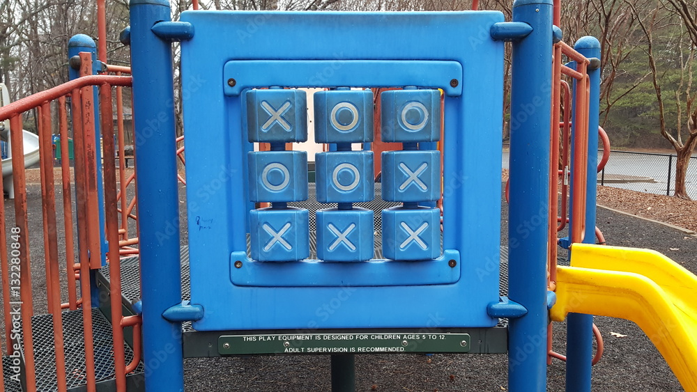

Tic Tac Toe
==============
made by Eliza

*I'd like to dedicate this award to Daisy. Cause I love her heapz! & Delta who showed me i was born to try.*

## Thanks  
* Shout out to Carter for being confused about why CLASS of DRAW hates me.
* & helping. 
* Thanks to zoom party animals, who took a chance on an uknown kid. 
* The wonderful crew at Frank's Lab for showing me cubes.
 Without which, this css & js & html smoosh would not be possible. 
 
### I learnt...
>*So if we had a long ass box...
Then when we map it's like mary poppins giving orders to each child living in her box...
she doesn't use their real names cause she doesn't care about them. they're all the same to her, they're just things in her box...
and she walks down to each child and says "right, each one of you is gonna do this" and you can tell them to do whatever you want.* - Daisy

### Pen & Paper
I mapped out my logic on pen and paper. I started off broadly mapping what I needed to happen. I needed a board. Two players. The game itself. The winner. The draw. 
    I broke each of these into seperate chunks. I began with co-ordinates. Then realised it was too complicated and just named everything by it's number. So like, 0 always dealt with 0 button, array index, string order. 
    It made it easier to then write the code knowing what i needed to do in each chunk. And then the chunks of chunks. Chunking down to the chuckiest chunk of chunk. Chunk chunk chunk. 

### Ouch my brain!
In hindsight, most aspects of the tttrules.js felt like a persistent paper cut while sanitizing ones hands.   
  That being said, i consider it a success that I could at least see where the problem was. Sometimes correctly name the problem, Psuedo code my way through it enough to like know I needed other functions, or an empty array, or that I probably needed to have a dm with the DOM to like, have things happen.
    Notably, choice of using buttons. I figured they would be the simplest way for something to happen. Button gets clicked. Something happens. So for me the button could hide everything in JS while connecting with the user. So, the button essentially could do everything. 
    I needed so much help with the button! I haven't looked at the button function since Tuesday. I remember only the pain. The PAIN that was the button. So unpacking it will basically be a therapy session... Like so  
>'I was sitting at my desk, all my paper notes scattered, video off, audio off, staring at the zoom screen wondering why everyone seemed so calm and has good posture. Suddenly an early childhood memory- I must have been a baby- i was trying to shove moosh that had once been bread into my gob and punched myself in the face'.  
  
## I'm going to...
Make it spin, like in a playground. Cause I want to. 
  A bit prettier but same nostalgic vibe. 
also make it obvious who's turn it is. 

## More stuff I learnt
I really like css. 
  Emmet shortcut when dealing with DOM is helpful. But I relied on it over using jQuery. 
  Class and Id's are my friends!
  Use the 'Try it Yourself' box in MDN when it's available.
  Console logs are also my friends.
  Making things different colours is handy for debugging. 

    Also, i couldnt make a draw class or draw anything in html that was interacting with css. No idea why!!!